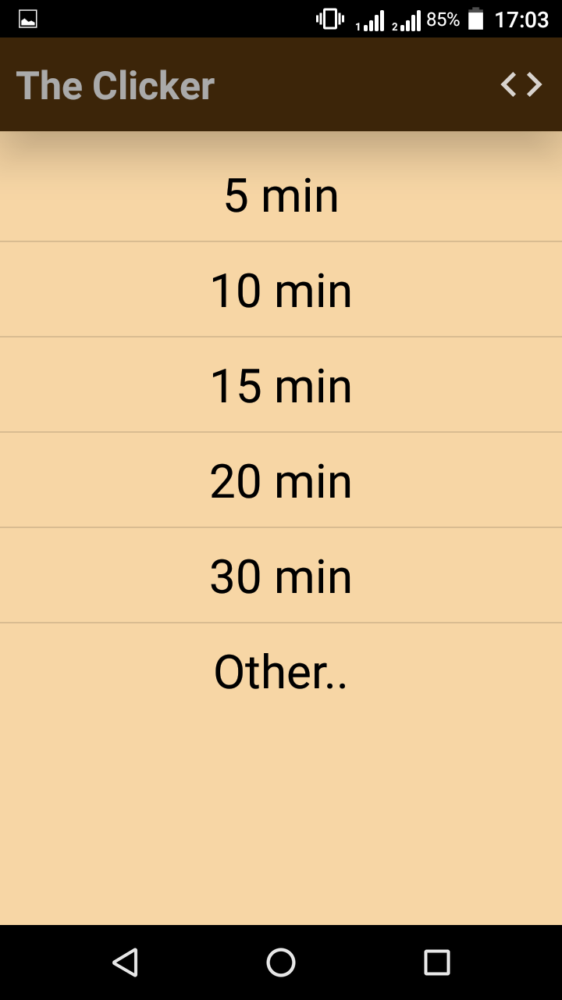
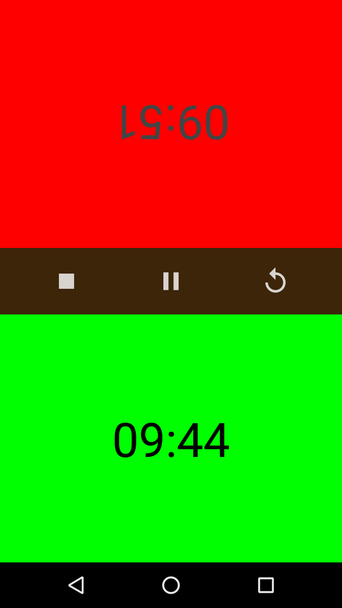

# A Chess-timer android application (v1.0)

A simple chess-timer android application where users can choose any length of time (not more than 100 minutes) and the countdown begins! Please feel free to contribute and of course, modify and use in your own personal projects.

Author: Taslim Oseni
==========================================================================

### About:

* written in: Java and XML.

* IDE used: Android studio

* compatible with all android smartphones with SDK 19 or higher.

### Requirements:

Android smartphone (min SDK: 19)

### Installation:

* Download or clone from https://www.github.com/TaslimOseni/Pawn-down, build and run
* Download <a href="https://play.google.com/store/apps/details?id=com.dabinu.apps.chesstimer">here</a>

### Preview:

  
  

  

  

### To do:
* Introduce two-device mode where users can run time each other from two different devices connected through WiFi
* Improve UI and add animations

### Issues:
* null
