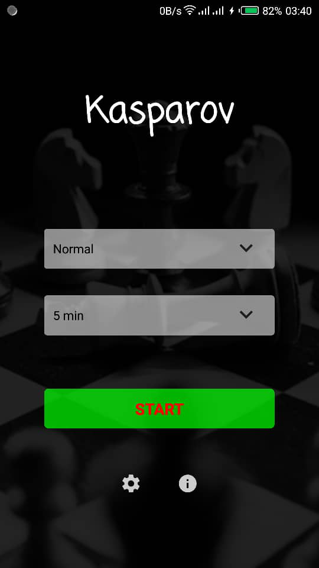
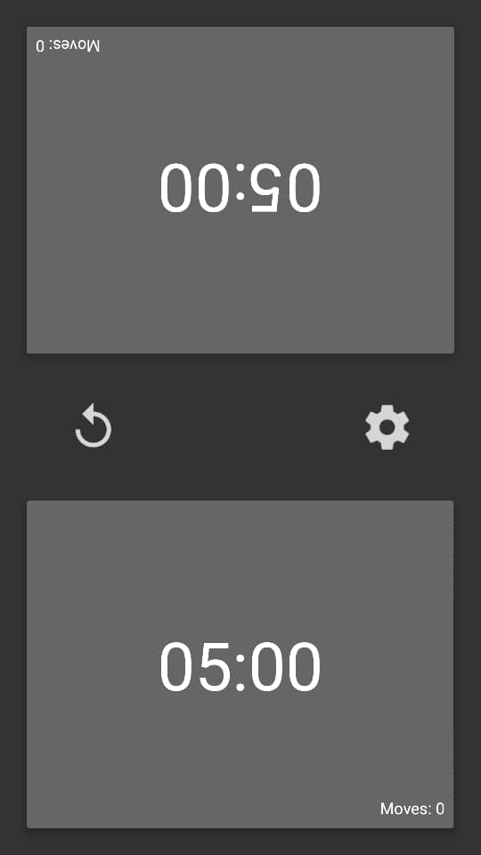
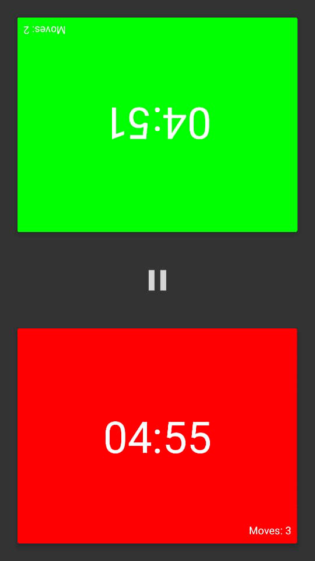
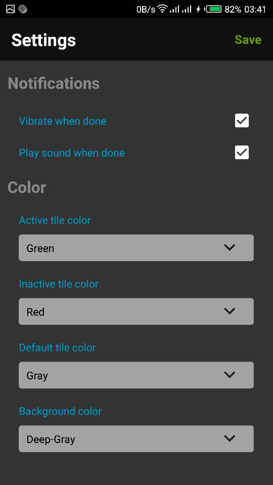

# A Chess-timer android application (v2.0)

A simple chess-timer android application where users can choose any length of game-time and the countdown begins! Please feel free to contribute to this project.

Author: Taslim Oseni
==========================================================================

### Requirements:

Android smartphone (min SDK: 19)

### Installation:

* <a href="https://github.com/TaslimOseni/Kasparov.git"><b>Github</b></a>
* <a href="https://play.google.com/store/apps/details?id=com.dabinu.apps.chesstimer"><b>Google Play Store</b></a>

### Preview:

  
  
  
  

### Issues:
* null
